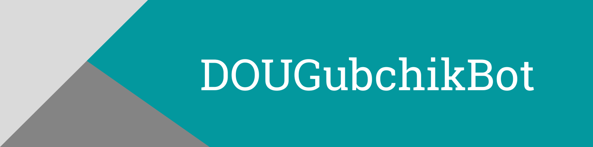

_Bot for for tracking new vacancies on the jobs.dou.ua website_

### Demo

Click **<a href="https://t.me/DOUGubchikBot" target="_blank">here</a>** to open telegram DOUGubchikBot

### Project modules (requirements.txt)

          

---

### License

[DOUGubchikBot](https://github.com/Gubchik123/DOUGubchikBot) is licensed under the [MIT License](https://github.com/Gubchik123/DOUGubchikBot/blob/master/LICENSE.md).
            
### Contributing

Feel free to contribute.

You can create an [issue](https://github.com/Gubchik123/DOUGubchikBot/issues/new) to report a bug, suggest an improvement for this plugin, ask a question, etc.

You can make a [pull request](https://github.com/Gubchik123/DOUGubchikBot/compare) to contribute to this bot development.

 

### Support

If you like this project, you can support me to help me keep working on projects.

Buy me coffee on [buymeacoffee.com/Gubchik123](https://www.buymeacoffee.com/Gubchik123)

